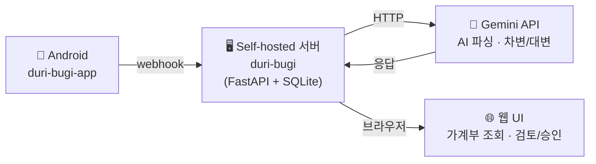

# 두리부기 (duri-bugi)

부부가 함께 쓰는 AI 자동 가계부.

아내와 같이 쓸 가계부가 필요해서 직접 만들었습니다. 쓰다 보니 꽤 쓸만해져서 공개합니다.

### 어떻게 동작하나요?

카드 긁으면 알림이 뜨잖아요. 그 알림을 AI가 읽어서 가계부에 자동으로 적어줍니다.
부부 각자 폰의 알림이 하나의 가계부에 모이니까, 따로 입력할 게 없어요.

### 특징

- **입력할 게 없음** — 카드/은행 알림이 오면 AI가 금액, 가맹점, 계정을 자동 분류
- **부부 공동 가계부** — 두 사람의 카드·계좌 내역이 한 곳에 모임. 누가 어디서 얼마 썼는지 한눈에
- **내 서버, 내 데이터** — 셀프호스팅이라 금융 내역이 외부로 나가지 않음
- **복식부기** — 단순 수입/지출 기록이 아니라 자산·부채·수입·비용을 정확히 추적
- **검토 워크플로우** — AI가 분류한 결과를 승인/수정/거부할 수 있어서 오분류 걱정 없음
- **대시보드 & 리포트** — 월별 지출 추이, 카테고리별 비교를 차트로 확인

## 구조



> **필수 요건**: Self-hosted 서버 + Gemini API 키

## 주요 기능

- **웹훅 수신** — Android 앱에서 카드/은행 알림을 실시간 수신
- **AI 자동 파싱** — Gemini 2.5 Flash로 금액, 가맹점, 계정 자동 매칭
- **복식부기** — 차변/대변 분개장 기반 가계부
- **멀티 디바이스** — `deviceName`으로 기기별 계정 분리 (예: 꾸_하나카드, 양_신한카드)
- **검토 워크플로우** — AI 파싱 결과를 승인/수정/거부
- **계정 관리** — 드래그&드롭 정렬, 인라인 편집, 그룹/하위 계정 지원
- **대시보드** — 자산/부채/수입/지출 요약, 월별 추이 차트
- **멀티유저 PIN 인증** — 사용자별 PIN 로그인, 감사 로그
- **카테고리 규칙** — 반복 가맹점 자동 분류 학습

## 기술 스택

- **Backend**: FastAPI + SQLAlchemy + SQLite
- **Frontend**: Alpine.js + SortableJS (SPA, 빌드 없음)
- **AI**: Google Gemini 2.5 Flash
- **배포**: Docker

## 빠른 시작

### Docker (권장)

```bash
# 1. 환경변수 설정
cp .env.example .env
# .env 파일 편집 — GEMINI_API_KEY, APP_PINS 등 설정

# 2. 빌드 & 실행
docker compose up -d --build

# 3. 접속
# http://localhost:8000
```

### 로컬 개발

```bash
# Python 3.12+
pip install -e .
uvicorn app.main:app --host 0.0.0.0 --port 8000 --reload
```

## 환경변수

| 변수 | 필수 | 설명 |
|------|------|------|
| `GEMINI_API_KEY` | Y | Google Gemini API 키 |
| `APP_PINS` | N | 멀티유저 PIN (`123456:이름,789012:이름`) |
| `SESSION_SECRET` | N | 쿠키 서명 시크릿 (기본값 있음) |
| `WEBHOOK_SECRET` | N | 웹훅 HMAC 검증 시크릿 |
| `SESSION_DAYS` | N | 세션 유효기간 일수 (기본: `7`) |
| `DATABASE_URL` | N | DB 경로 (기본: `sqlite:///ledger.db`) |

## 웹훅 포맷

Android 앱에서 아래 JSON을 `POST /api/webhook`으로 전송:

```json
{
  "type": "NOTIFICATION",
  "source": "com.shinhancard",
  "sourceName": "신한카드",
  "deviceName": "꾸폰",
  "title": "",
  "content": "신한카드 승인 15,200원 스타벅스 일시불 03/16 14:23",
  "timestamp": 1710568800000
}
```

## 프로젝트 구조

```
app/
├── main.py              # FastAPI 앱, 마이그레이션, 시드 데이터
├── config.py            # 환경변수 설정
├── database.py          # SQLAlchemy 엔진/세션
├── models.py            # ORM 모델 (Account, JournalEntry, AuditLog 등)
├── schemas.py           # Pydantic 스키마
├── routers/
│   ├── webhook.py       # 웹훅 수신 & 백그라운드 처리
│   ├── transactions.py  # 거래 CRUD
│   ├── accounts.py      # 계정 관리
│   ├── dashboard.py     # 대시보드 & 리포트
│   ├── rules.py         # 카테고리 규칙
│   └── auth.py          # PIN 인증
├── services/
│   ├── ai_parser.py     # Gemini AI 메시지 파싱
│   ├── ledger.py        # 분개 생성 로직
│   └── audit.py         # 감사 로그
└── static/              # 프론트엔드 (HTML/JS/CSS)
```

## 라이선스

AGPL-3.0
